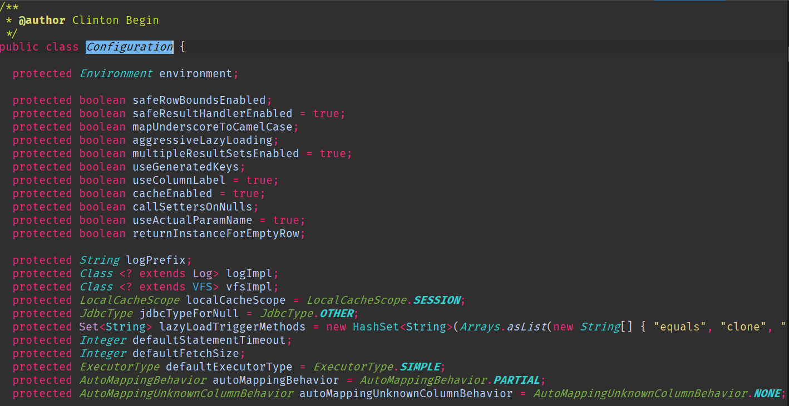
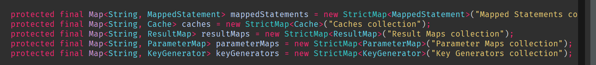
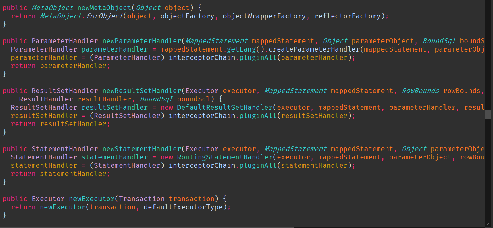
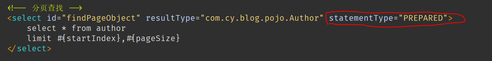

# 第二章：Mybatis的核心对象

+ mybatis 是对JDBC的封装，是在sqlSession 的基础之上进行封装的
主要进行封装的是：JSBC connection, Statement resultSet 

+ 在整个mybatis架构中，至少还要包含了==> 
```
    sqlSessionFactory 
    mybatis-config.xml, 
    Mapper.xml 

```
## 1、数据存储对象

    概念：在Java（JVM）中，对相关的数据配置构建配置数据类。
    ```
    mybatis-config.xml ==> Configuration 
    
    ->environment
    ->mappers
    ->settings
    ->typealiases

    ```
1、会将设置的参数映射为Configration 对象的属性(封装了mybatis-config.xml)



2、会有一系列的数据存储 (这个个map中存储的是全局的全部的主要对象，
这些map中的key=> (namespace.id)),封装了mappedStatement


3、会进行一些核心对象的创建
 

    ```
        *mapper.xml ==> mappedStatement 

    ```
1、mapper文件中的每一个sql 对应了一个mappedStatement 对象，存储在map中，存贮的key是(namespace.id)
mybatis中有三种对应的statement,mybatis使用了preparedStatement作为了默认的，当我们需要其他类型时，
可以在书写的sql标签中进行指定。

```
    Statement(普通的statement)

    PreparedStatement(预编译的statement) default
    
    callableStatement(主要针对存储过程调用)

```
 

2、mapper.xml 文件中每一组包含sql的标签都封装成了一个mappedStatement, 在 mappedStatement 中包含了
一个BoundSql对象，这个对象专门用于封装sql语句的实体和参数

## 2、操作类对象

### Executor
 Executor 是mybatis 中处理功能的核心，
   1、增删改 update  查（query）
   2、事务的操作（提交，回滚）
   3、缓存相关的操作

 Executor 被设计为一个接口 =>（设计上一个基本的原则--操作(功能)相关的类需要设计成接口类型）

 Executor 的实现类 ：
   - BatchExecutor 
     - JDBC中批处理操作 
   - ReuseExecutor
     - 复用statement
     - 要求sql一样,参数一致
   - SimpleExecutor 
     - 最常用的Executor 
       Configuration 中 
       => protected ExecutorType  defaultExecutorType = ExecutorType.SIMPLE; 

### StatementHandler
  StatementHandler 是mybatis 中封装了JDBC statement 真正nybatis进行数据操作的核心

- Executor 中的工作中的第一部分被分离出来交给StatementHandler来操作。限定职责的
  单一,当然，Executor 可以进行这样的操作，但是这样就显得杂乱。
- 为什么不直接使用StatementHandler来进行操作，而是通过Executor 来操作，这样就能
  进行事务的控制，缓存的实现

- StatementHandler 也是一个操作，设计的时候应该被设计为一个接口，定义了基本的增删改查
  
  StatementHandle接口的实现类 
  + BaseStatementHandler
  + SimpleStatementHandler -- (JDBC)
  + PreparedStatementHandler
  + CallableStatementHandler
    
### ParameterHandler
  ParameterHandler 就是将mybatis参数 -> 转换为JDBC相关的参数
  
    @Param() --> #{  } --> ?

### ResultSetHandler 
  对JDBC中查询的结果集进行处理封装

### TypeHandler
  对数据库类型与java类型进行处理，进行转换。
  java类型    数据库类型
   ```
    String    varchar
    Long      int
    Date      datestamp
    ......
   ``` 

## 3、mybatis核心对象与sqlSession 是怎样联合工作的

  Mybatis 中的核心对象是在sqlsession 进行相关功能调用的时候产生联系的

  应用层面：

    ```
        UserDao userDao = Sqlsession.getMapper(UserDao.class);
        // UserDao 接口的实现类对象，
        // ?? UserDao 接口接口实现类在哪里
        // 动态字节码技术 --> 类在JVM运行时创建，JVM运行结束消失
        1、如何创建UserDao ...***Dao 的实现类
            |-代理。动态代理
            a、为原始对象（目标）增加【额外功能】
            b、远程代理（RPC）Dubbo --网络通信，数据通信
            c、无中生有(动态字节码技术)
        2、在实现类里面是怎样实现对应的方法的
        interface UserDao{
            void insert(User user);
        }
        // 实现类（这里是为了说明问题，象征性表示实现类中实现的功能，并没有这个类）
        public UserDaoImpl implements UserDao{
            // 实际的调用过程
            sqlSession.insert(User user){ };
                    |-Executor
                        |-StatementHandler
                            |- ParameterHandler
                                |-ResultSetHandler
                                    |-TypeHandler

        }
        // 底层在InvocationHandler中实际处理了dao 接口中方法的实现，
        UserDao userDao = (UserDao) Proxy
            .newProxyInstance(ClassLoading.Interface,InvocationHandler)

    ```

  Mybatis 完成代理的创建， 核心类型，—— Dao接口的实现类

  ```
    MapperProxy implements InvocationHandler 
     - invoke()
    
    ...
    
    // 用于构建MapperProxy 代理对象
    MapperProxyFactory 
     - Proxy.newProxyInstance()

  ``` 

## 4、Mybatis 怎样解析mybatis-config.xml 

- 当我们要在java程序中应用其他文件的内容（*.xml）,那么首先需要将这个文件组织
  的内容转换为java中的对象（java是面向对象的语言，一切皆对象）;
  java中解析xml 文件的方式主要有以下三种

  + DOM、SAX、XPath

  mybatis 种主要就是使用XPath的方式来解析xml文件的

    ```
        InputStream in = Resource.getResourceAsStream("mybatis-config.xml");
        SqlSessionFactory factory = SqlSessionFactoryBuilder().build(in);
        // 开启sqlSession 会话
        SqlSession sqlSession = factory.openSession();

    ```
  将xml文件中的内容成功的映射为Java中的对象
    * mybatis-config.xml ==> Configuration
    * *Mapper.xml ==>  MapperStatement
    -------------------------------------------
   mybatis 使用的是XPath自己封装的xml解析方式，
    * XPathParser(读取，分析) ==> XNode（对应xml文件中的标签）,
    * XPath 是一种表达式，代表特定的xml标签含义
    ```
        InputStream == XXX.xml
        XPathParser xPathParser = new XPathParser();
        // XNode 对象中就包含了xml 标签中的名字，属性，标签中的内容
        List<XNode> xNodes = xPathParser.evalNodes("xPathExpress");
        /* 将XNode 中的内容映射到对应的对象中的属性，这样就可以完成
         * xml 文件向Java对象的转化。
        */
    --------------------------------------------------
        xPathParser --> XNode --> Configuration
        
        |-build() --> parserConfiguration(parser.evalNode("/configuration"));
                                    |
                   Configuration <——|
                         |          |
                         |      mapperElement(root.evalNode("/mappers"));
                         |          |
                         |      XmlMapperBuilder --> build()
                         |          |
                         |      MapperParser.parser()--> MapperStatement
                         |          |
                  Configuration.addMpperStatement(MapperStatement);
    ```
  解析出来的Configuration 主要是用来构建SqlSessionFactory

    ```
      SqlSessionFactory build(Configuration configuration){
          new DefaultSqlSessionFactory(configuration);
      }
    
      sqlSessionFactory.openSession();
            |
          final Environment environment = configuration.getEnvironment();
          final TansactionFactory transactionFactory = getTransactionFromEnvironment(environment);
          tx = transactionFactor.newTransaction(environment.getDataSource(),level,autoCommit);
          final Executor executor = configuration.newExecutor(tx,execType);
            |
      return new DefaultSqlSession(configuration,executor,autoCommit);

    ```
