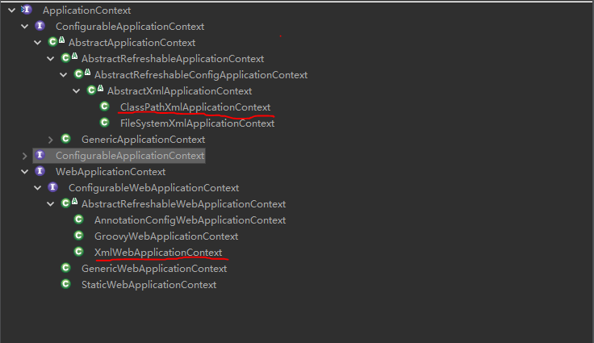

# 第一章 第一个Spring程序

- 加入spring依赖

```xml
    <!-- Spring核心依赖 -->
    <dependency>
        <groupId>org.springframework</groupId>
        <artifactId>spring-context</artifactId>
        <version>5.1.4.RELEASE</version>
    </dependency>
```
- Spring 的配置文件
    
    + 位置要求--> 没有要求，
    + 名称要求--> 没有要求，建议是：applicationContext.xml

    **当没有按照约定的位置写配置文件，需要主动告知spring配置文件的位置**

1、Spring的核心API

- ApplicarionContext 接口
    + 作用: 主要用于对象的创建
    + 好处: 解耦合
    + 设计成接口 == 可能会被应用在不同的场景，需要做不同的实现
        * 在非web环境：(main,junit) ClassPathXmlApplicationContext
        * web环境：XmlWebApplicationContext

     

- ApplicationContext 是重量级资源
    + ApplicationContext 工厂的对象占用大量的内存
    + 不会频繁的创建这样的工厂，每个应用内只有一个工厂对象。
    + ApplicationContext工厂：一定是一个允许多线程同时访问的线程安全的工厂

2、程序开发步骤
    
* 创建对象
* 配置文件(applicationContext.xml)中配置<bean/>
    
```xml
    <bean id="user" class="com.edu.pojo.User"/>
```
* 通过工厂获取对象

```java
    ApplicationContext ctx =
        new ClassPathXmlApplicationContext("/applicationContext.xml")
    User user = (User)ctx.getBean("user");
```
**配置文件的细节**
```
    1. id 在某些场景是可以省略的
        <bean class="com.edu.pojo.User"/>
        <!-- 
            a) 当没有配置id属性的时候，会生成默认的名称
            b) 应用的场景，当这个bean只会被使用一次的时候，可以省略这个id
                           但是这个bean需要被多次使用的时候就需要设置id值
        -->
    2. name属性的作用

       * 用于在<bean>中定义bean对象的别名
        <bean id="user" name="emp,user" class="com.edu.pojo.User"/>
        <!-- 
            name是bean的别名，可以有多个（逗号分隔），
            id : 只能有一个，xml 中规定了 id 命名须要符合某种规范（随着程序进步，已经没有这个要求了）  
            name: 比较灵活，可以使用任何规则定义字符串名称
        -->

    3. spring 工厂通过反射来创建对象，其本质还是通过构造方法来创建了对象。
       即使这个构造方法是私有的，也是可以通过反射来调取的

    4. 普通的数据对象，一般是由持久层框架进行创建封装，对应数据库中的数据，
       不由spring工厂进行创建。
```

