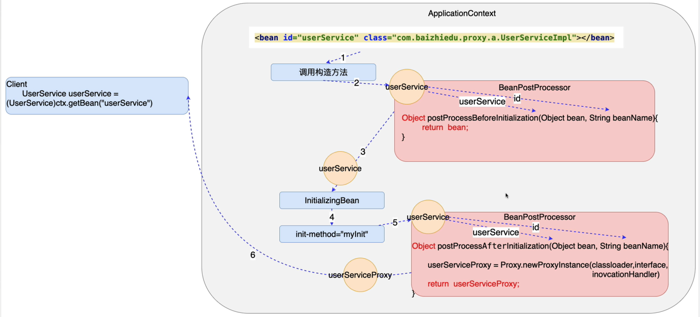

# 第十章 后置处理Bean

1. BeanPostProcessor 作用,对Spring工厂创建的对象进行再加工

2. 底层使用的是AOP实现的:

    **BeanPostProcessor 是一个接口，实际的加工过程在具体的方法中进行实现就可以了**
```java
/* 
* 从这个接口中的俩个需要实现的方法就知道这两个方法分别是在初始化之前和初始化之后
* 执行的
*/ 
public interface BeanPostProcessor {
    /*
    * 这个方法是在构造了bean之后，完成了注入，执行这个方法，之后再交给initializing
    * (如果有Initializing)，之后再交给下面的方法
    * -- 创建的对象通过方法的参数来获取
    * -- 返回处理之后的bean对象
    */

    @Nullable
    default Object postProcessBeforeInitialization(Object bean, String beanName) throws BeansException {
        return bean;
    }

    /*
    * 这个方法应该是在执行完成Intializing之后再执行的，
    * -- 创建的对象通过方法的参数来获取 
    * -- 返回处理结束的对象
    */
    @Nullable
    default Object postProcessAfterInitialization(Object bean, String beanName) throws BeansException {
        return bean;
    }
}
```
3. BeanPostProcessor 的处理方法方法实现细节
 - 当初始化方法不存在的时候，不必区分前置还是后置，实现其一就可以（实战中初始化很少用）
 - 当初始化方法存在的时候，需要区分，看准是都要实现还是实现哪一个比较合理。

### 开发步骤

- 类需要实现BeanPostProcessor 接口
```java
/**
 * 这个加工的过程是针对所有的Spring 工厂中产生的bean来进行操作的,
 * 注入了属性名称,通过这个后置处理演示更改这个名称看一下这个更改的效果。
 */
public class MyBeanProcessor implements BeanPostProcessor {
	@Override
	public Object postProcessBeforeInitialization(Object bean, String beanName) throws BeansException {
		return bean;
	}
	/**
	 * 为了展示加工的效果，我们将已经注入的name属性进行更改，
	 * 然后看最终对象的name属性值，以显示加工是否成功。
	 */
	@Override
	public Object postProcessAfterInitialization(Object bean, String beanName) throws BeansException {
        /*
        * 由于这个方法会作用与所有的Spring工厂生产的bean,因此这里因该是有一个类型保护的
        * 不然这个代码在处理其他bean对象的时候会异常，运行结果也会出现异常。
        */
        if(bean instanceof User){
            User user = (User)bean;
            user.setName("里斯");
            return user;
	    }
        return bean;
    }
}

```
- Spring 配置文件中进行配置

```xml
    <!--
         测试 BeanPostProcessor 的使用,在配置文件中配置这个 bean 就可以了，
         他会作用于所有的工厂创建出来的bean,
    -->
    <bean id="mybeanprocessor" class="com.edu.beanpostprocessor.MyBeanProcessor"/>

    <!-- 配置文件中注入的名称是"张三" 通过后置处理会将名称改编成"里斯"-->
    <bean id="user" class="com.edu.pojo.User">
    	<property name="name" value="张三"/>
    	<property name="password" value="1735465756"/>
    </bean>
```

> Spring工厂是如何使用BeanPos他Processor 对对象进行代理加工，使得接口返回的是一个
  代理对象



