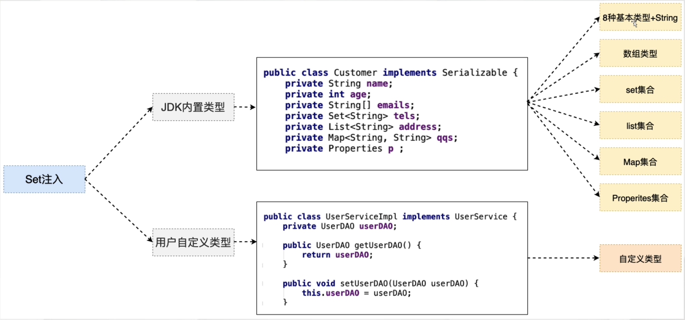

# 第三章 依赖注入

为了解耦合，我们不需要在代码中来进行对象的属性的赋值，而是通过配置文件
中配置，框架通过反射，将对象的属性设置好，返回一个已经配置好的对象。
```
<bean id="userDI" class="com.edu.pojo.User">
    <!-- 通过property 标签为bean注入属性值-->      
    <property name="name">
        <value>萧先生</value>
    </property>     
    <property name="password">
        <value>1231244535</value>
    </property>    
</bean>

```
## 实现的原理(简易)分析

- 通过property 标签为bean注入属性值,property 标签的name属性值需要与对象的属性保持
  一致，使用value标签为属性赋予值

- 通过这个属性注入的形式，实际上等价于反射调用了setter方法来进行设置属性的值，
  当这个类的属性没有setter 方法的时候，这个注入的方式是不成功的。代码会直接报错。


## 细节分析 

- 属性是有类型的，可能是Sting, Integer, Long .... 还有可能是一个List, Map, 
  还有可能是一个对象，这样的属性，应该使用使用什么样的方式来注入
  
  * 不管是什么样的属性，都是需要使用property 属性的
  * 根据不同注入值类型使用的是不同的标签
   
  
* JDK类型的变量的赋值
 ```
    1. 基本类型使用的是<value> 标签进行赋值
    <property name="name">
        <value>萧先生</value>
    </property>

    ==> 基本类型和String 类型，可以使用value 属性代替value标签
    <property name="name" value="萧先生">

    2. 数组、List 使用的是<list> 标签进行赋值
    <property name="urlList">
        <list>
            <value>yahu.com</value>
            <value>baidu.com</value>
            <value>google.com</value>
        </list>
    </property>
    
    3. Set 使用的是<set> 标签进行赋值
    <property name="phone">         
        <set>               
            <value>37945830</value>
            <value>37945834</value>
            <value>37945856</value>
        </set>
    </property>

    4. Map 类型的注入使用的是<map><entry></entry></map>
    <property name="qqs">
        <map>
            <entry>
                <key><value>huhai</value></key>
                <value>7589367983</value>
            </entry>
            <entry>
                <key><value>hufeng</value></key>
                <value>7540990376</value>
            </entry>
        </map>
    </property>

    5. Properties 类型 使用的是<props><prop></prop></props>
    <property name="pro">
        <props>
            <prop key="key1">vb1</prop>
            <prop key="key2">vb1</prop>
        </props>
    </property>

    6. Date 等复杂的类型，需要自定义类型转换器才能进行注入
    
```

* 自定义类型的注入

 第一种方式

   1. 为属性赋予 getter 和 setter 方法
   2. 配置文件
   ```
    <bean id="userService" class="com.edu.service.impl.UserServiceImpl">  
        <property name="userDao">  
            <bean class="com.edu.dao.impl.UserDaoImpl"/>
        </property>   
    </bean>
   ```
   **缺点**

   1. 当多个类中需要注入UserDao,那么就会出现大量的重复代码。
   2. 这样的方式，会根据写入的class,创建对象，这样会出现很多的重复对象
  
  第二种方式:  

  ```
    <!-- 这样定义的bean可以复用这个bean -->
    <bean id="userDao" class="com.edu.dao.impl.UserDaoImpl"/>
    <bean id="userService" class="com.edu.service.impl.UserServiceImpl">  
        <property name="userDao">  
            <ref bean="useDao"/>
        </property>   
    </bean>

    ==>  简化写法(引用自定义对象，可以使用ref属性代替ref标签)

    <bean id="userService" class="com.edu.service.impl.UserServiceImpl">  
        <property name="userDao" ref="userDao"/>  
    </bean>
  
  ```
* 简化set属性注入的写法
    
   1. 基本类型与String 可以使用value属性代替value标签
   2. 自定义类型的引用，可以使用ref属性代替ref标签
   3. 基于引入命名空间(引入p 命名空间)之后的简化写法
```
<property name="name">
    <value>萧先生</value>
</property>

==> 基本类型和String 类型，可以使用value 属性代替value标签
<property name="name" value="萧先生">

==> 引入命名空间之后的简化写法
<bean id="user" class="xxx.User" p:name="萧先生"/>

--------------------------------------------------------------------------

<bean id="userService" class="com.edu.service.impl.UserServiceImpl">  
    <property name="userDao">  
        <ref bean="useDao"/>
    </property>   
</bean>

==> (引用自定义对象，可以使用ref属性代替ref标签)

<bean id="userService" class="com.edu.service.impl.UserServiceImpl">  
    <property name="userDao" ref="userDao"/>  
</bean>
 
==> 引入p 命名空间之后，简化写法 
<bean id="userDao" class="xxx.UserDaoImpl" p:userDao-ref="userDao"/>

```


