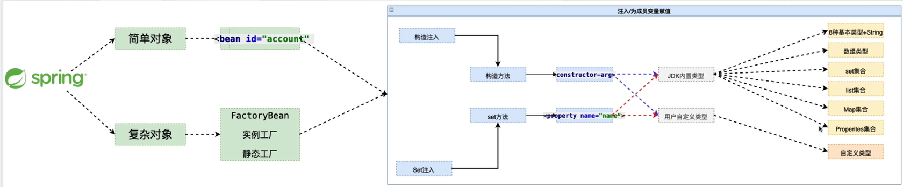

# 第六章 Spring 复杂对象的创建

1. 简单对象：指的是可以通过new 构造方法 直接创建的对象。
2. 复杂对象：不能直接通过new 构造方法直接创建的对象·

```
 ==> 比如：
 Connection :
    Class.forName("com.mysql.jdbc.Driver");
    conne = DriverManager.getConnection();

 SqlSessionFactory:
    InputStream in = Resource.getResourceAsStream("path");
    new SqlSessionFactoryBuilder.build(in);

```
## Spring 创建复杂对象的3种方式

### FactoryBean 接口

1. 实现FactoryBean 接口
```java
public class MyFactoryBean implements FactoryBean{

    // 实现接口中的三个方法就可以
    @Override
    public Object getObject(){
        // 定义这个复杂对象的具体的创建方法
    }

    @Override
    public Class getObjectType(){
        // 返回对应的创建对象的类对象
    }
    
    public boolean isSingleton(){
        // 返回的对象是否需要每次使用都创建(创建一次，反复使用)
    }
```
2. 配置文件的编写

```xml
<!--
    注意:
    1、需要获取的对象是复杂对象，而这个对象是通过实现factoryBean 接口创建的，
        这时候代码中通过id 获取的时候获得的是复杂对象，而不是创建工厂
-->
    <bean id="connection" class="com.edu.factorybean.ConnectionFactoryBean"/>
```

3. 细节分析
    
- 如果就想获取创建工厂的对象，而不是创建出来的对象 获取的 id = &id
- isSingleton() 方法的返回值，决定了创建对象的次数，这个返回值是true
  还是false,应该根据具体的情况来决定，比如:
    + 1、数据库连接就不应该进行复用那么每次使用的时候就应该创建新对象，就应该返回false,
    + 2、SqlSessionFactory 重量级资源，全局应该是唯一的，就是进行复用的，应该返回true

4. 实现原理(简易分析)

- 为什么Spring 要留下这个factoryBean 接口让用户来实现。
- ctx.getBean("id");获取的时候获得的是复杂对象，而不是创建工厂

   > 本质上，原理的核心是接口的回调
```
    ctx.getBean("id") --> 获取到一个对象 --> instanceOf(FactoryBean)
                                                    |
                                     false          |            true
                                    ---------------------------------
                                    |                               |
                        Class.forName("${class}")               getObject();
                                    |                               |
                                    ----------------------------------
                                                    |
                                            return Object;
```

5. 总结FactoryBean
   Spring 中创建复杂对象的一种方式，也是Spring原生支持的，后续Spring 整合其他框架的时候
   大量的使用了FactoryBaan


### 实例工厂

> 出现这个方式的原因

1. 避免Spring的侵入，使用 FactoryBean 方式创建对象 --> 依赖Spring,脱离Spring 将不可用
2. 整合遗留系统,创建对象的方法已经由第三方提供，拿不到源文件。

```java
// 假定的三方提供的获取连接的方法
public class ConnectionFactory{

    public Connection getConnection(){
        Class.forName(driverClass);   
        connection = DriverManager.getConnection(url,username,password);
        return conne;
    }
}
```
- 当需要将这种实例工厂创建对象的方式交给Spring来管理的时候，配置文件中这样配置就可以了

```xml
<!-- 给定创建bean对象的创建的实例工厂，创建对象的方法 -->
<bean id="connectionFactory" class="com.edu.factorybean.ConnectionFactory"/>
<beam id="conn" factory-bean="connectionFactory" factory-method="getConnection"/>

```

### 静态工厂

> 这个静态的工厂解决的问题与实例工厂是相同的，只是一个是静态方法，一个是实例方法
- 当需要将这种实例工厂创建对象的方式交给Spring来管理的时候，配置文件中这样配置就可以了
```xml
<!-- 3、静态工厂 -->    
<!-- 给定创建bean对象的刀Q建的静态工厂，创建对象的方法,(由于静态方法不需要类实例，只需要给定类对象就可以) -->    
<bean id="staticConnectionFactory" class="com.edu.factorybean.StaticConnectionFactory" factory-method="getConnection"/>

```

## 总结

 

