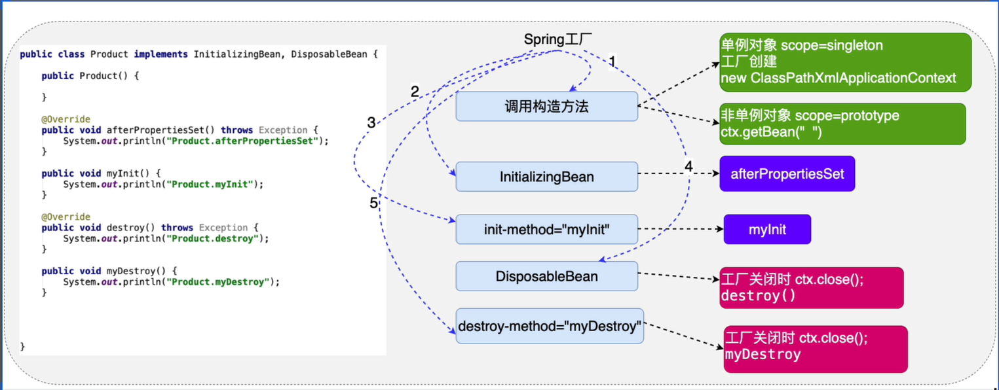

第七章 控制对象创建的次数

1. 普通对象创建次数的控制

```
<!-- 控制简单对象的创建次数，只要添加一个scope=(singleton{单例，默认值}/protoType{多例})  属性就可以了  -->   
<bean id="account" scope="singleton" class="com.edu.scope.Account"/>

```
2. 复杂对象创建次数控制
    - FactoryBean 接口创建的对象根据isSingleton返回值决定，
    - 实例工厂与静态工厂也是使用scope属性来控制

3. 为什么需要控制对象的创建次数
    - 节约内存(不需要多次创建的对象不要多次创建)

4. 什么样的对象创建单次，什么样的需要每次都创建

     > 单例对象
    - SqlSessionFactory(重量级资源)
    - DAO(操作数据的公用的对象)
    - Service(处理具体业务的对象)
    - ......
     > 多例对象
    - Connection (数据库连接)
    - SqlSession (mybatis用户会话)
    - Struts2, Action
    - ......


# 第八章 对象的生命周期--工厂的高级特性

1. 什么是对象的生命周期
    - 指的是对象的创建，存活，消亡的过程
    - 由Spring负责对象的创建，存活，销毁，了解生命周期，有利于更好的使用Spring
      为我们创建的对象。

2. 生命周期的3个阶段

#### 创建阶段
> Spring何时创建对象

+ scope=singleton 的时候对象在创建工厂的时候进行创建
+ scope=protoType 的时候，对象在使用的时候创建
+ 添加 lazy-init="true" 属性可以实现单例对象的懒加载 
```xml
<bean id="product" scope="singleton" lazy-init="true" 
      class="com.edu.scope.Product"/>
```

#### 初始化阶段
> Spring 在创建对象后就会调用对象的初始化方法，完成初始化操作，
- 初始化方法提供：程序员更具希求进行开发，提供，最终提供初始化方法
- 初始化方法调用：Spring 调用

a. 实现 initializingBean 接口
- 在 afterPropertiesSet() 方法中完成初始化

```java
    public class Product implements InitializingBean {
        public Product() {
            super();
            System.out.println("测试创建时间: Produst");
        }
        // 对象创建完成后进行初始化操作。
        @Override
        public void afterPropertiesSet() throws Exception {
            System.out.println("initializing : Product");
        }
    }
```
b. 自定义方法进行初始化，然后在配置文件中配置为初始化方法

  * 好处:可以减少对Spring框架的耦合*

```java
    public class Product implements InitializingBean {
        public Product() {
            super();
            System.out.println("测试创建时间: Produst");
        }
        // 对象创建完成后进行初始化操作。
        @Override
        public void afterPropertiesSet() throws Exception {
            System.out.println("initializing : Product");
        }
    }
```
配置文件
```xml
<bean id="product" init-method="afterPropertiesSet" class="com.edu.scope.Product"/>
```

c. 细节分析

* 当同时安排两个方式的初始化方法，会同时执行，并且先执行
    - InitializingBean 中的 afterPropertiesSet() 方法，
    - 再调用配置文件中指定的方法。

 * 注入的操作是发生在初始化的前面
    - 从 afterPropertiesSet() 这样的名字中就可见端倪了
 * 初始化操作一般做什么样的事情
    - 资源的初始化操作：数据库，IO，网络 。。。

#### 销毁阶段

 Spring在销毁对象之前，会调用对象的调用方法，完成销毁操作
 1. Spring 什么时候销毁创建的对象 --> ctx.close()
 2. 销毁方法：程序员根据自己需求自己定义，Spring 来调用
 3. 一般销毁的操作是资源释放的操作--> 数据库，网络，IO。。。
    
    > 销毁方法同样有两种实现方式

    a. 实现disposableBean 接口
      - 实现接口的destroy()方法来执行销毁前的操作

    ```java
    public class Product implements InitializingBean,DisposableBean{
        public Product() {
            super();System.out.println("测试创建时间: Product");
        }
        // 对象创建完成然后进行初始化操作。
        @Overridepublic void afterPropertiesSet() throws Exception {
            System.out.println("initializing : Product");

        }
        // 自定义的初始化方法
        public void selfInitializing() {
            System.out.println("selfInitializing");
        }
        @Override
        public void destroy() throws Exception {
            System.out.println("对象销毁: Product");
        }
        // 自定义的销毁方法
        public void selfDestroy(){
            System.out.println("自定义销毁: Product");
        }
    }
    ```
    b. 自定义一个销毁的方法，然后在配置文件中进行配置
        
    - destroy-method="selfDestroy"

    ```
    <bean id="product" destroy-method="selfDestroy" class="com.edu.scope.Product"/>
    ```

    c. 细节分析：
        
    - 与初始化方法一样，当自定义与接口同时写入的话，接口方法先执行，自定义后执行
    - 销毁对象是发生在工厂销毁之前。
    - **<销毁方法只适用于scope=singleton的对象,不做用于scope=ptototype对象>**

### 对象创建的生命周期总结

 


