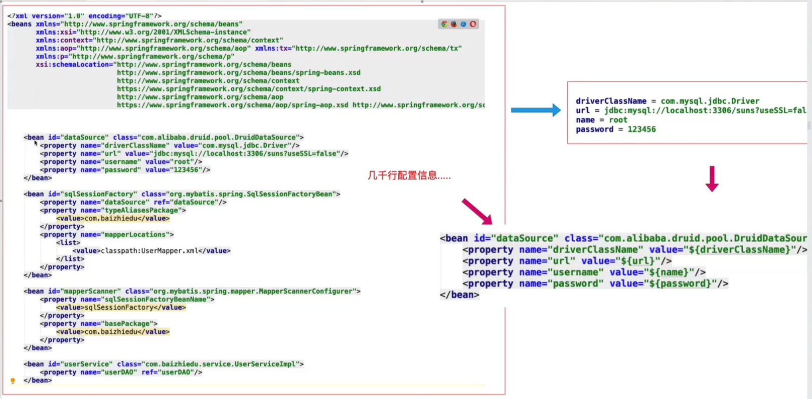

# 第八章 配置文件参数化

配置文件参数化：把Spring中需要经常修改的字符串信息，转移到一个小的配置文件中
    
- 经常修改的字符串：
    + 数据连接参数(数据库的用户名，密码等)
    + 特殊需求的路径配置等
    + ......
- 实际项目中Spring的配置文件是非常大的一个文件，几千行都有可能，
  减少维护人员的维护成本，提取这些信息修改可以更方便，快捷.
  减少出错。

- 提取成 .properties 文件。可以使用占位符引入到Spring文件中。

- 如何将 .porperties 文件位置 ==> 引入到Spring

 

## 开发步骤

 1. 将参数使用占位符替代
 2. 将需要配置的参数转换为properties文件形式
    
    * 名字位置都是没有要求的。
 
 ```txt
    jdbc.driverClassName=com.mysql.cj.jdbc.Driver
    jdbc.url=jdbc:mysql:///blog?serverTimezone=GMT%2B8
    jdbc.username=root
    jdbc.password=root
 ```
 3. 在Spring 中配置好配置文件的位置，方便Spring 配置中引入这些配置。
 ```xml
    <context:property-placeholder location="classpath:/db.properties">
 ```


