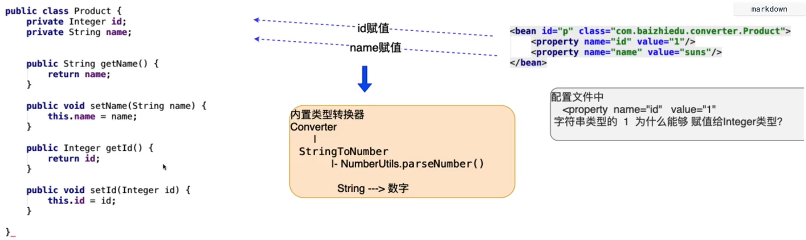

# 第九章 自定义类型转换器

1. 类型转换器：Spring 在底层通过类型转换器中字符串的类型的数据，转化成
对象中成员变量对应类型的数据，进而完成了注入。
    ----------------------------------------------------------


    2. 自定义类型转换器的由来：当Spring中没有提供某些类型的转换器的时候，
    就需要程序员自己定义一些转换器。

    - 比如Spring就只提供了一种日期类型的转换器,（自定义的日期格式无法进行转换）
    （因为各个国家的时间格式不同想要统一进行处理基本不可能）

#### 开发过程

1. 自定义某种类型的转换器实现Converter<S, T> 接口
    - S = source 源数据类型
    - T = Target 目标数据类型
    ```java
    public class MyDateConverter implements Converter<String, Date>{

        /**
         * param:source 表示的是配置文件中传入的需要转换的数据源
         * return, 返回值就是返回的目标值，然后对属性进行注入
         */
        @Override
            public Date convert(String source) {
                SimpleDateFormat sdf = new SimpleDateFormat("yyyy-MM-dd");
                Date date = null;
                try {
                    date = sdf.parse(source);
                } catch (ParseException e) {
                    e.printStackTrace();
                };
                return date;
            }
    }
    ```
2. 在配置文件中创建转换器对象

    ```xml
    <bean id="myDateConverter" class="com.edu.converter.MyDateConverter"/>
    ```
3. 需要将自己定义的类型转换器注册到Spring 类型转换器集合中，

    ```xml
    <bean id="conversionService" class="org.springframework.context.support.ConversionServiceFactoryBean">
        <property name="converters">
            <set>
                <ref bean="myDateConverter"/>
            </set>
        </property>
    </bean>
    ```
4. 细节分析
* 类型转换器中必须要有对应的匹配的注入的日期格式，说明这个类型转换器是
  依赖于这个日期的格式的，可以将这个日期格式变成一种依赖关系，然后将
  这个格式变成一种配置，方便以后进行变更
    1. 对应的类型转换器依赖进行解耦合
    ```java
      public class MyDateConverter implements Converter<String, Date>{
        private String datepattern;
        public String getDatepattern() {
            return datepattern;
        }
        public void setDatepattern(String datepattern) {
            this.datepattern = datepattern;
        }
        /**
         * param:source 表示的是配置文件中传入的需要转换的数据源
         * return, 返回值就是返回的目标值，然后对属性进行注入
         */
        @Override
        public Date convert(String source) {
            SimpleDateFormat sdf = new SimpleDateFormat(datepattern);
            Date date = null;
            try {
                date = sdf.parse(source);
            } catch (ParseException e) {
                e.printStackTrace();
            };
            return date;
        }
    }
    ```
    2. 配置文件修改(注入这个属性)
    ```xml
    <!-- 配置类型转换器对象 -->
    <bean id="myDateConverter" class="com.edu.converter.MyDateConverter">
        <property name="datepattern" value="yyyy-MM-dd"/>
    </bean>
    ```
* 由于注册类型转换器的bean是已经存在的对象，当我们进行注入操作的时候，必须在配置文件中
  严格按照 id ，class 类别进行书写，否则注入不成功

* Spring 其内部是有内置的日期类型的转换器的，
    
    - 默认只支持 【2000/12/09】格式，其他的格式是不支持，需要自己定义转换器。
